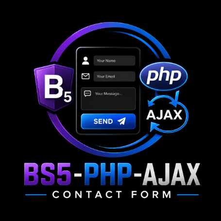

# Bootstrap 5 PHP AJAX Contact Form

**(You need to know: Cut / Move and Copy / Pate Operations)**



Designed to work with 1 HTML FORM on page with 2 INPUT-s (name, email) and 1 TEXTAREA (message)

## Installation

1. Copy "JS" file where you like and include it in HTML something like this

```<script src="js/form-submit.js"></script>```

2. Copy "PHP" file to same place where is HTML file